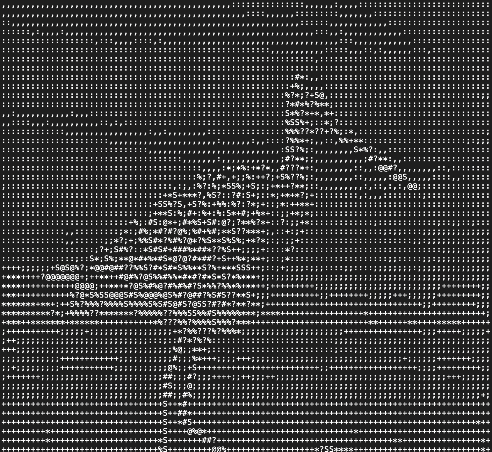

# Asciify-Image
A python script that transforms any images to ascii art (filled with ascii characters)

# Example image
Before:


After:


# Pre-Setup
This program requires pip3 pre-installed and as well as the Pillow module

pip3 install Pillow

pip3 install image

# Execution
Type this in command line
``` bash
python3 transform.py bird.jpg
```

The output (ascii art) is displayed in output.txt